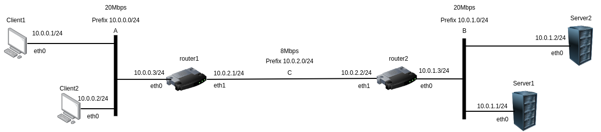
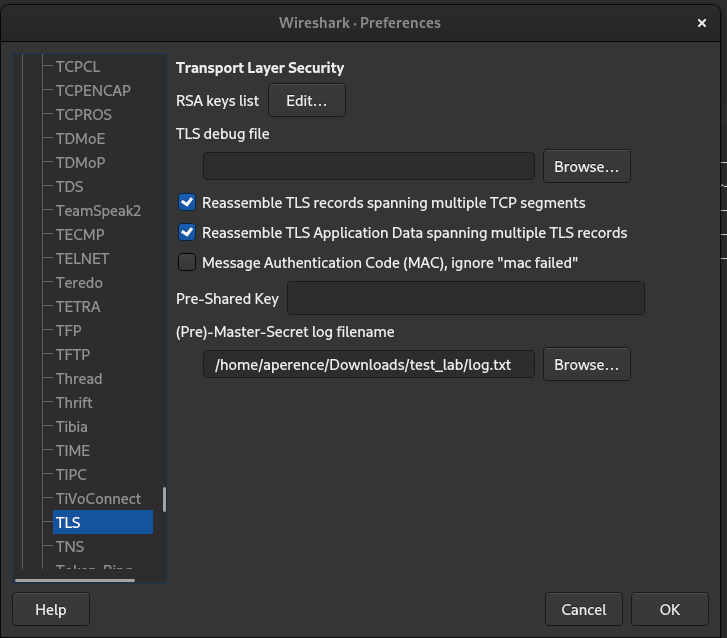

# LINFO1341 : QUIC and Congestion Control Lab

## Requirements

- Docker : can be installed easily by following the instructions on their [main site](https://docs.docker.com/get-docker/)
  
- [Kathara](https://www.kathara.org/) : to install it, just follow the guide on their site, or the guide on the [wiki](https://github.com/KatharaFramework/Kathara/wiki)

- If you are on a Red-Hat Based device, uncomment the line `67` of the [start](./start) script.

## Description of the lab

In this lab, you'll learn (at least we hope so) how congestion control works, as well as why we decided to implement these algorithms in the first place.

To do so, we'll work on a quite simple configuration:



The clients will send data to the server (do an upload of a file), but the problem is the bottleneck link between the 2 routers that has a limited bandwidth to only ~8Mbps. The two clients will need to share this link appropriately in order to be able to transmit at the same time.

During this lab, you'll see :
- why using a fixed cwnd might not be the best idea
- how congestion control reacts to a loss
- how two clients can share fairly the same link
- how rtt can influence (or not) the growth of cwnd
- how routers can also play a role in a fair share of a link (fair queuing)

The methodology in this lab is using scenarios that will run transactions in specific conditions and allow to show you how the quic protocol with its congestion control algorithm reacts to these.

## Qlogs

In order to record the events in the different scenarios, the clients and servers are configured to log information in qlogs. The exact format is described in the [qlog rfc](https://datatracker.ietf.org/doc/draft-ietf-quic-qlog-main-schema/).

By default, the qlogs are stored /lab/shared/NAME_SCEN/LOG_ID where LOG_ID is a randomly generated identifier. A script to parse these file is provided in [src/qlog_parser.py](src/qlog_parser.py).

We'll use qlogs during this lab, as the plotter is based on those to represent the variation of fields.

During this lab, you can also disable the qlogs if you want, to check if it has any impact on the performances of transmission. To do so, just don't mention the argument `--log-dir` when running a client/server. You can also modify the scenarios if you want to.

## Running the pre-made scenarios

To run the scenarios, simply open a terminal in this folder.

Type the following command:

```
./start
```

This will run the lab, and should after some time open a terminal as `root@main`. This terminal will be the main hub where you'll be able to run the differents scenarios given to you, as well as connecting to the other devices if you want to play by yourself with the congestion control.

You can now follow the instructions contained in the [lab README](lab/README.md) to learn how to run the transmissions, and see the evolution of cwnd per time. You may want to use wireshark though during this lab, if it is the case, just follow the instructions of the [wireshark section](#sniffing-packets-using-wireshark) below.

To shutdown the lab once done, just use the command 
```
exit
```
to quit the main hub, and type :
```
./clean
```
to remove all the files created by the lab

## Sniffing packets using wireshark

During these labs, you can use wireshark to sniff packets and see in real-time how quic works.

To do so, some (small) preparation are needed, but we will explain everything to you.

First of all, launch the wireshark capture by going to [http://localhost:3000](http://localhost:3000), and start a capture on `eth0`.

After that, when starting a client, you'll have to specify a log file for the secret keys. These keys will be needed in order to decode the messages exchanged during the communication. To do so, the only thing you need to do is specify a path to a file where these keys should be saved when lauching the client. We suggest you to save it in the `/shared` folder, as it will allow you to get it on your local device easily. For example:

```
python3 ./client.py ./scenarios/small_data.txt --keylog-file ../shared/log.txt
```

(Note: the step of saving the key is automatically done for you when running the scenarios, and will be saved in `lab/shared/keys.txt`)

Wait for the quic transaction to be done.

Once the client ended, you can now go in Wireshark>Edit>Preferences>Protocols>TLS.

You'll end up on a screen similar to this: 

Here, paste the path of the log file you entered in the client earlier, in the field **(Pre)-Master-Secret log filename**. 

Aaaand that's it, everything is now configured and you'll be able to see in clear the content of each packet exchanged during your transaction. Just be careful to always include the log-file argument when lauching the client from now on, otherwise you won't be able to see the content of packets.

## Getting the answers

To get the answers of the lab, simply contact the teaching team of [linfo1341 course](https://uclouvain.be/cours-2023-linfo1341), on the official moodle page of the course if you have access to it, or directly by contacting them by email if you don't have an UCLouvain account.

## Acknowledgements
Thanks to Olivier Bonaventure, Maxime Piraux, François Michel, Louis Navarre and Aurelien Buchet who allowed me to realize this project, and gave feedback along the development of this project, allowing to improve it even further !

